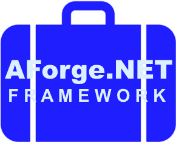

Portable AForge.NET Framework
=============================

*AForge.NET Framework*: Copyright (c) 2006-2013 AForge.NET; licensed under Lesser General Public License (LGPL) version 3. 
*Shim.Drawing* class libraries: Copyright (c) 2013-2015 Anders Gustafsson, Cureos AB; licensed under General Public License (GPL) version 3.

This project is a fork of Andrew Kirillow's original [AForge.NET Framework](https://code.google.com/p/aforge/) project. 
For general information and tutorials, see [here](http://www.aforgenet.com/aforge/framework/).

The repository currently provides:

* Portable Class Libraries for base and imaging functionality functionality (Core, Math, Genetic, Fuzzy, MachineLearning, Neuro, Imaging, Imaging.Formats, Vision), 
* Portable Class Library *Shim.Drawing* to substitute .NET *System.Drawing* types not covered by PCL, and
* Target specific *Shim.Drawing* libraries for .NET Framework 4.5 and higher, and Windows Phone Silverlight 8 and higher.

The *Portable AForge.NET* class libraries depend on the PCL [Shim](https://github.com/cureos/shim) and/or *Shim.Drawing* assemblies. In applications however, the target specific (Windows Phone Silverlight or WPF)
*Shim* and *Shim.Drawing* assemblies should be referenced, to ensure that the target specific version of each type is used.

Installation
------------

The preferred method for using *Portable AForge.NET* in your application is to download the required packages, including dependencies, from [NuGet](https://www.nuget.org/packages?q=portable.aforge). Open the NuGet Package Manager
in Visual Studio and search for **portable.aforge** to obtain a list of the currently available packages on *NuGet*.

Usage
-----

`WriteableBitmap`:s provide input and output to the imaging functionality in the WPF and Windows Phone Silverlight libraries. The target specific *Shim.Drawing* assembly 
incorporates explicit cast operators between `WriteableBitmap` and `System.Drawing.Bitmap`.

All image processing is performed on the mock `System.Drawing.Bitmap` class, `WriteableBitmap` objects should only be used as initial input to and final output from the
image processing.

When using the WPF *Shim.Drawing* assembly, the *System.Drawing* assembly from .NET Framework cannot be referenced since this would lead to type name collisions. If there is a need to reference 
the real *System.Drawing* assembly, you are recommended to use the original *AForge.NET Framework* libraries and use WPF hosting controls to display image processing results instead.

This same approach can be applied in WPF and Windows Phone Silverlight applications.

    // Use explicit operator to convert from WriteableBitmap to Bitmap
    Bitmap bitmap = (Bitmap)aWriteableBitmapObject;

    // Apply one or more filter functions on the Bitmap object
    var filter1 = AForge.Imaging.Filters.Grayscale.CommonAlgorithms.RMY;
    bitmap = filter1.Apply(bitmap);
    var filter2 = new AForge.Imaging.Filters.CannyEdgeDetector();
    filter2.ApplyInPlace(bitmap);

    // Use explicit operator to convert back from Bitmap to WriteableBitmap
    aWriteableBitmapObject = (WriteableBitmap)bitmap;

Building the libraries
----------------------

The preferred method for including *Portable AForge.NET* in your application is *NuGet*. However, if you prefer to build the libraries by yourself, follow these guidelines:

* You will need to prepare a strong name key, (.snk) file *Shim.Drawing.snk* and place this file in the same folder as the main *Portable AForge* folder, for example the *Projects* folder.
* Then, open the *Portable Build All.sln* solution file located in the *Sources* folder and build the entire solution or selected projects. Visual Studio 2012 Professional or higher is required.
 
**IMPORTANT!** 
* PCL projects cannot be built in Express versions of Visual Studio prior to 2013 Update 2. 
* To be able to reference the target specific (WP8, .NET/WPF) *Shim.Drawing* assemblies, all underlying assemblies need to have a strong name, i.e. be signed. 

Notes on commercial use
-----------------------

The *Shim.Drawing* assemblies that are required to build the Portable Class Library version of AForge.NET Framework are published under the General Public License, version 3.

There are *Shim* and *Shim.Drawing* assemblies available for *Xamarin.Android* and *Xamarin.iOS*, making it possible to 
incorporate *Portable AForge* assemblies in *Android* and *iPhone* or *iPad* apps. See for example [this](http://cureos.blogspot.com/2014/10/smartphone-image-processing-development.html) blog post. 

*Shim Drawing* is available for evaluation from *NuGet* for all supported platforms.

To purchase a commercial license of *Shim.Drawing* for *Android*, *iOS* or *Universal*/*Windows 8.1*/*Windows Phone (non-Silverlight) 8.1* for unlimited distribution of *Portable AForge* and *Accord* based applications on app stores, simply click on one of these buttons:

<table>
<tr>
<th>Android</th>
<th>iOS</th>
<th>Windows</th>
<th>All platforms</th>
</tr>
<tr>
<td></td>
<td></td>
<td></td><td></td>
</tr>
</table>

Please note that *AForge.NET Framework* itself is licensed under LGPL version 3, and the copyright holder states the following on the *AForge.NET Framework* web site:

> Regarding collaboration, contribution, offers, partnering, custom work/consulting, none GPL/LGPL licensing, etc., please, contact using the next e-mail:
aforge.net [at] gmail {dot} com

